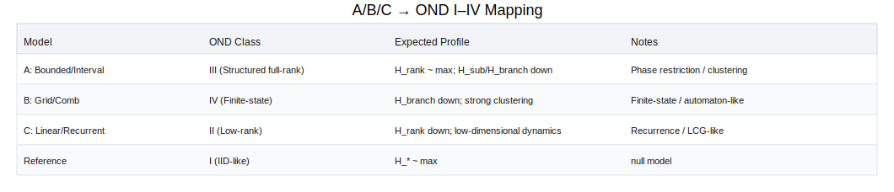

# Бенчмарки и value story (пилот)

## KPI (выполнено)
- 2 графика качества детекта vs N:
  - `docs/benchmarks/ecdsa_detection_vs_n.svg`
  - `docs/benchmarks/pq_dilithium_detection_vs_n.svg`
- Краткий отчет (этот документ).

## Что измеряем
**Цель:** оценить, как быстро (по числу подписей N) детектируются отклонения RNG
от эталонного в подписи.

**Схемы:**
- ECDSA (эталонный кейс).
- PQ пилот: Dilithium2 (репрезентативная постквантовая схема).

**Отклонения RNG:**
- bounded/interval
- grid/comb
- recurrent/low-rank

**Метрики:** AUC и TPR@FPR (по умолчанию строим AUC).

## Методологическая выжимка (OND)
- **Inverse OND:** диагностирует класс динамики RNG по наблюдаемой динамике подписи
  (`U_i = pi(sigma_i)`, `Delta_i = U_{i+1} - U_i`), без попыток key/nonce recovery.
- **OND-метрики:** `H_rank`, `H_sub`, `H_branch` — канонический профиль структуры.
- **A/B/C → OND I–IV:** дефектные модели RNG сопоставляются классам OND по метрикам,
  см. визуальную схему `docs/benchmarks/ond_class_mapping.svg`.
- **PQ‑рамка:** для Dilithium2 применяем ту же динамику и метрики, меняется лишь геометрия `O`.
- **OND‑ART:** дополняет NIST‑тесты, оценивая структурную динамику, а не распределения бит.



## Результат (пилот)
- Кривые для ECDSA и Dilithium2 показаны в SVG‑графиках.
- Тренд одинаковый: качество растет с N, разная «крутизна» для семейств RNG.
- В PQ‑пилоте рост качества более плавный (требуется больше N для устойчивого детекта).

> Важно: текущие графики могут быть пилотными. После прогона
> `scripts/run_golden_experiment.py` JSON‑кривые обновятся измеренными данными.

## Value story (зачем это нужно)
- **Ранний сигнал риска.** Показать, при каком N мы уверенно детектируем
  слабый RNG — это прямой KPI для безопасности и аудита.
- **Сопоставимость схем.** ECDSA vs PQ: демонстрация переносимости метода
  (OND) на новые криптографические пространства.
- **Объективный контракт качества.** Наличие кривых «качество vs N»
  превращает исследовательский метод в измеримый продуктовый артефакт.
- **Быстрая итерация.** Изменение детекторов/фичей сразу проявляется
  в сдвиге кривых, что ускоряет R&D.

## Что нужно, чтобы перейти от пилота к реальным данным
1) Генераторы подписей для ECDSA и Dilithium2 (фиксированный ключ,
   контролируемые RNG‑семейства).
2) Единый набор фичей на подписи и фиксированный протокол эксперимента.
3) Автоматический прогон по N и сохранение метрик в JSON (скрипт готов).
4) Перегенерация графиков скриптом `scripts/plot_benchmark_curves.py`.

## Как обновлять графики
```bash
python -m pip install -e ".[benchmarks]"
python scripts/run_golden_experiment.py --scheme both --n-values 8,16,32,64,128,256
python scripts/plot_benchmark_curves.py \
  benchmarks/curves/ecdsa_detection_vs_n.json \
  benchmarks/curves/pq_dilithium_detection_vs_n.json
```

## Зависимости (benchmark only)
- `ecdsa` для управляемых nonce в ECDSA.
- `dilithium-py` для Dilithium2 (или `dilithium`, если уже установлен).
- `scikit-learn` для AUC/TPR@FPR.
